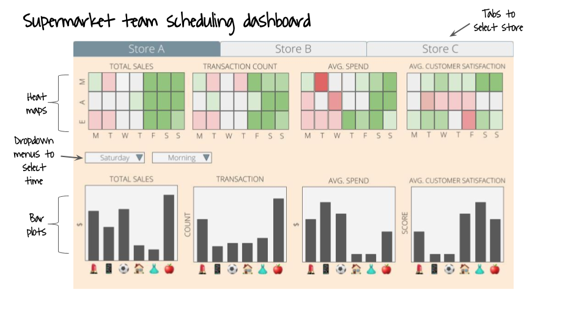

# DSCI_532_group-106_supermarket
A Python dashboard by Reiko Okamoto, Haoyu Su and Monique Wong

## Description 
The dashboard consists of a landing page that shows four heat maps showing total sales, transaction count, average spend and average customer satisfaction. Using the tabs, the user can toggle between different stores and select which one to analyze. The user can compare the values of the above variables across business hours and decide on the specific day of the week and/or the time of day to further explore. Using the dropdown menus, the user can select the day of the week (i.e. Monday through Sunday) and/or the time of day (i.e. morning, afternoon, evening). After the selection, the user will be able to see four bar plots that can be used to compare total sales, transaction count, average spend, and average customer satisfaction across the  product lines (i.e. departments in the supermarket) during the specified time. All eight plots will be shown at once (arranged in a 2 x 4 grid) so that the user can make comprehensive comparisons and staff the store appropriately in a data-driven way.

## Sketch 

